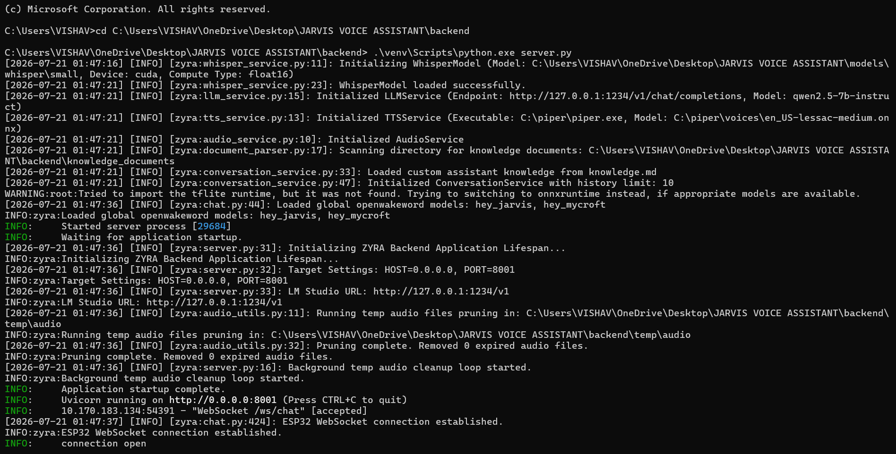

# 🎙️ ZYRA — Modular AI-Powered Voice Companion

> **Meet ZYRA:** A privacy-first, low-latency, modular AI voice companion built with hardware integration at heart. Powered by ESP32-S3, real-time WebSockets, local Speech-to-Text, local LLMs, and neural Text-to-Speech — 100% offline with zero cloud dependency!

---

## 📸 Project Showcase

### 📸 Hardware Setup
Here is the assembled ZYRA hardware satellite client featuring the ESP32-S3 microcontroller, INMP441 digital I2S microphone, MAX98357A DAC audio amplifier with speaker, and the OLED status display.


---

### 🖥️ Backend Intelligence & Real-time Console
The local FastAPI backend coordinating real-time WebSockets, audio streaming, Whisper transcription, local LLM responses, and Piper TTS synthesis.



---

### 🎬 Live Demo Video
Experience ZYRA in action! Watch how ZYRA captures voice commands, processes reasoning locally, and responds with natural voice synthesis:

https://github.com/user-attachments/assets/demo-video

> 📹 **Local Video File:** You can also find the raw full HD video clip at [`Screenshots/Demo Video.mp4`](Screenshots/Demo%20Video.mp4).

---

## ✨ Why ZYRA? (A Humanised Perspective)

Have you ever wanted an intelligent voice assistant like JARVIS or Alexa, but wished it was **completely private**, **fully customizable**, and didn't send every word spoken in your home to a distant cloud server?

That is exactly why **ZYRA** was created!

ZYRA splits the workload smartly between two partners:
1. **The Satellite (Hardware Client):** A lightweight, low-cost ESP32-S3 microcontroller placed on your desk. It acts as the "ears, mouth, and eyes" of the assistant — capturing your voice via an INMP441 I2S mic, giving visual feedback on a tiny OLED screen, and speaking back through a clear I2S DAC speaker.
2. **The Brain (Local PC Server):** A Python FastAPI server that runs locally on your PC. It takes raw digital audio over WebSockets, transcribes it in real-time with **Faster-Whisper**, thinks using **Qwen 2.5** (via LM Studio), and speaks back using human-sounding neural voices with **Piper TTS**.

Whether you want a desk companion, a home automation trigger, or a voice interface for a robotics project, ZYRA gives you 100% control over every single line of code and piece of hardware.

---

## 🏗️ Architecture Diagram

Here is how data flows seamlessly between the **Hardware Satellite** and the **Local AI Brain**:

```mermaid
graph TD
    subgraph ESP32-S3 Satellite Client "Ears, Eyes & Mouth"
        A[🎤 INMP441 I2S Mic / BOOT Button] -->|16kHz PCM16 Audio Stream| B[Persistent WebSocket Client]
        B -->|Audio Playback Stream| C[🔊 MAX98357A DAC & Speaker]
        B -->|OLED State Events & Text| D[📺 SH1106 / SSD1306 OLED Display]
    end

    subgraph Local PC Brain "The AI Engine"
        B <===>|Full-Duplex WebSockets| E[FastAPI Server Controller]
        E -->|WAV Audio Chunk| F[⚡ Faster-Whisper STT]
        F -->|Transcribed Text| G[🧠 Qwen 2.5 Instruct LLM]
        G -->|Assistant Response| H[🎙️ Piper Neural TTS]
        H -->|PCM Audio Payload| I[🔊 Sound Resampler & DSP]
        I -->|Synthesized PCM Stream| E
    end
```

---

## 🚀 Key Features

- 🔒 **100% Offline & Private:** Zero cloud APIs required. Your voice data never leaves your local network.
- ⚡ **Ultra Low-Latency WebSockets:** Binary 16kHz PCM audio streaming over standard WebSockets ensures instant response times.
- 🗣️ **Local Multilingual STT & TTS:** Handles English, Hindi, and Hinglish with Whisper transcription and Piper neural voice models (`en_US-lessac` and `hi_IN-pratham`).
- 📺 **Dynamic OLED Visualizer:** Real-time state indicators (`Connecting`, `Ready`, `Listening...`, `Thinking...`, `Speaking...`) with animated visualizers and scrolling text.
- 🎛️ **Dual Trigger Modes:** Choose between hands-free wake word activation ("Hey Zyra") or push-to-talk using the hardware BOOT button.
- 🔊 **Digital Volume Control:** Dynamic PCM amplitude scaling with clipping protection built right into the backend.
- 🔌 **Modular C Firmware:** Developed using ESP-IDF v5.5.4 and FreeRTOS for smooth multitasking and memory optimization.

---

## 🔌 Hardware Wiring & Pin Mapping

Here is the exact pin configuration used to wire the ZYRA satellite to an **ESP32-S3 DevKitC-1** board:

| Module | Pin Name | ESP32-S3 Pin | Description / Function |
| :--- | :--- | :--- | :--- |
| **INMP441 Mic** | `SCK` | **GPIO 5** | I2S Serial Clock |
| | `WS` | **GPIO 4** | I2S Word Select (LR Clock) |
| | `SD` | **GPIO 6** | I2S Serial Data Out |
| | `L/R` | `GND` | Mono Left Channel |
| | `VDD` / `GND` | `3.3V` / `GND` | Power Supply |
| **MAX98357A DAC** | `LRC` | **GPIO 16** | I2S Left-Right Clock |
| | `BCLK` | **GPIO 15** | I2S Bit Clock |
| | `DIN` | **GPIO 7** | I2S Data Input |
| | `Vin` / `GND` | `5V` / `GND` | 5V Power for max volume output |
| **OLED Display** | `SDA` | **GPIO 8** | I2C Data Line |
| | `SCL` | **GPIO 9** | I2C Clock Line |
| | `VDD` / `GND` | `3.3V` / `GND` | Power (`0x3C` I2C Address) |
| **User Input** | `BOOT Button` | **GPIO 0** | Hold-to-Talk Push Button |
| **Status LED** | `RGB LED` | **GPIO 48** | Onboard WS2812B Addressable LED |

---

## 🛠️ Software Stack

- **Firmware:** ESP-IDF v5.5.4 (C/C++), FreeRTOS kernel, `esp_websocket_client`, U8g2 OLED drivers.
- **Backend Framework:** Python 3.13, FastAPI, Uvicorn ASGI server, WebSockets.
- **AI Models:**
  - **Speech-to-Text (STT):** `faster-whisper` (CTranslate2 implementation of OpenAI Whisper).
  - **Large Language Model (LLM):** `Qwen 2.5 7B Instruct` hosted locally via [LM Studio](https://lmstudio.ai/).
  - **Text-to-Speech (TTS):** `piper-tts` ONNX local engine.

---

## ⚡ Quick Start Guide

### 1️⃣ Prepare the AI Brain (Backend)

1. Clone this repository:
   ```bash
   git clone https://github.com/vishu2212/Voice_Assistant_KIYARI.git
   cd Voice_Assistant_KIYARI/backend
   ```
2. Create and activate a Python virtual environment:
   ```bash
   python -m venv venv
   # On Windows:
   .\venv\Scripts\activate
   # On Linux/macOS:
   source venv/bin/activate
   ```
3. Install dependencies:
   ```bash
   pip install -r requirements.txt
   ```
4. Start **LM Studio**, download `qwen2.5-7b-instruct`, and start the local server on port `1234`.
5. Run the FastAPI backend:
   ```bash
   python server.py
   ```

### 2️⃣ Flash the Hardware Satellite (ESP32-S3 Firmware)

1. Open your ESP-IDF command prompt (v5.5.4 recommended).
2. Navigate to the custom firmware directory:
   ```bash
   cd firmware/zyra-esp32
   ```
3. Set target and compile:
   ```bash
   idf.py set-target esp32s3
   idf.py build
   ```
4. Flash the board and open serial monitor (replace `COMX` with your COM port):
   ```bash
   idf.py -p COMX flash monitor
   ```

---

## 🎮 How to Interact with ZYRA

1. **Power Up:** Connect the ESP32-S3 via USB-C. You will see `Starting ZYRA...` followed by `Connecting WiFi...` on the OLED screen.
2. **Ready Prompt:** Once connected, ZYRA plays a welcome chime and says *"Hello, I am Zyra."* The screen displays `Ready. Say: 'Hey Zyra' or press BOOT`.
3. **Ask a Question:**
   - **Hands-Free:** Say *"Hey Zyra"* to trigger listening mode.
   - **Manual:** Press and hold the physical **BOOT button (GPIO 0)** while speaking, then release when finished.
4. **Watch ZYRA Think & Speak:** ZYRA will show `Thinking...` while analyzing your query, then scroll the answer on screen while speaking out loud through the speaker!

---

## 🔮 Future Enhancements & Roadmap

- 🔋 **Complete Portability:** LiPo battery management (TP4056 + 5V Booster) for a pocket-sized wireless assistant.
- 📡 **Access Point (AP) Mode:** Host the server directly on a phone via Termux without needing an external Wi-Fi router.
- 🧠 **On-Chip Inference:** Lightweight local command recognition with ESP-Skainet directly on the ESP32-S3.
- 🏠 **Smart Home Automation:** Local Home Assistant & MQTT protocol integration for voice-controlled lights and plugs.

---

## 📄 License & Acknowledgments

Distributed under the **MIT License**. See [`LICENSE`](LICENSE) for more details.

Built with ❤️ using ESP32-S3, FastAPI, Whisper, Qwen, and Piper TTS.
